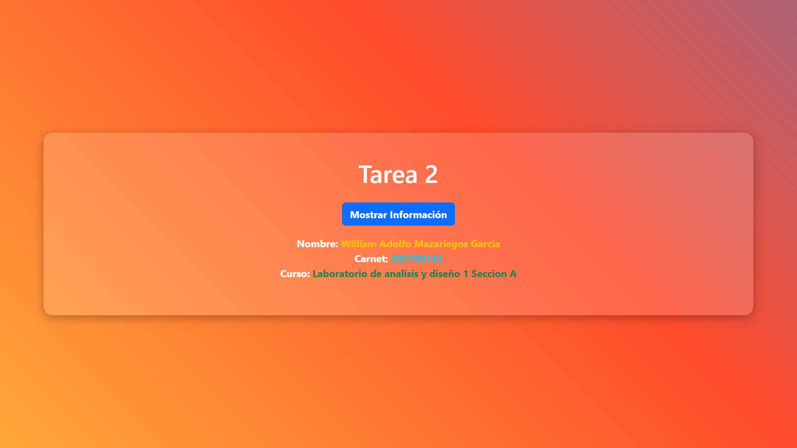

# Tarea 2 - William Mazariegos - 202100123

Este proyecto contiene una aplicación web en Flask que muestra el nombre, carnet y curso al presionar un botón.

## 📌 Cómo ejecutar en Docker

1. Clonar el repositorio:
   ```bash
   git clone https://github.com/WilliamMazariegos202100123/Ayd1-Tareas
   cd Tarea2
   ```
2. Contruir la imagen y ejecutarla:
```docker
docker build -t tarea2 .
docker run -d -p 80:80 --name tarea2-container tarea2
```

Veras algo como esto:v

```bash
CONTAINER ID   IMAGE     COMMAND           CREATED          STATUS          PORTS                NAMES
5dac8ae40c26   tarea2    "python app.py"   14 seconds ago   Up 13 seconds   0.0.0.0:80->80/tcp   tarea2-container
```

 Explicación:

`-d `→ Se ejecuta en segundo plano.
`-p 80:80` → Mapea el puerto 80 del contenedor al 80 de tu máquina.
`--name tarea2-container` → Nombre del contenedor.
`tarea2` → Nombre de la imagen que creaste.

3. Verificamos que este corriendo:
```docker
docker ps
```

4. Ingresar a `http://localhost:80` en tu navegador.



5. Detener y eliminar el contenedor:
```docker
docker stop tarea2-container
docker rm tarea2-container
```

Si quieres eliminar la imagen:
```docker
docker rmi tarea2
```